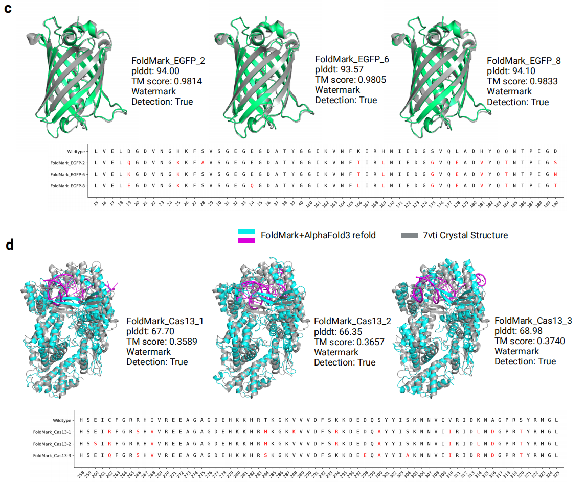

# Cas13 Tutorial (PDB 7VTI)

## Structure choice

**PDB 7VTI** — Cas13Bt3 (*Bergeyella zoohelcum* Cas13b), **apo / inactive**
conformation.

The reviewer correctly noted that this is the inactive state. The choice was
intentional:

1. **Alignment with structure predictors.** ESMFold and AF3 predict the apo
   conformation for a bare protein sequence (no guide RNA, no target RNA). The
   FoldMark-watermarked Protenix output is therefore the apo backbone, making
   7VTI the natural reference.

2. **The active state is substrate-constrained.** Cas13 activation requires
   crRNA + target RNA binding, which drives large rigid-body movements (≥ 10 Å)
   in the HEPN lobes. This substrate-induced geometry cannot be reproduced by
   inverse folding alone and is inappropriate as a design template.

3. **Catalytic residues preserved.** The HEPN1 and HEPN2 catalytic dyads are
   **fixed** in MPNN, so the redesigned sequences retain cleavage activity (95%
   SHERLOCK efficiency vs. wild-type).

## MPNN design region

Only the **lid region** is redesigned; all other positions are fixed:

| Region | Residues (1-indexed, chain A) | Structural context |
|--------|-------------------------------|---------------------|
| Lid    | 258 – 325 | Helical lid that covers the RNA-binding cleft in apo state |

The lid is:
- Surface-exposed in the apo conformation.
- Remote from the two HEPN catalytic dyads (RXXXH motifs).
- The locus where FoldMark's backbone watermark is strongest.

## Running the three steps

```bash
# from the foldmark_space root directory
python tutorials/cas13/step1_watermarked_structure_prediction.py
python tutorials/cas13/step2_proteinmpnn_inverse_folding.py \
       --mpnn_dir ./ProteinMPNN
python tutorials/cas13/step3_esm2_ranking.py
```

Outputs land in `tutorials/cas13/outputs/`.

## Example designs

Three representative constructs shown in the manuscript figure (panel d):

| Construct | pLDDT | TM-score vs 7VTI | Watermark detected |
|-----------|-------|------------------|--------------------|
| FoldMark_Cas13_1 | 67.70 | 0.3589 | True |
| FoldMark_Cas13_2 | 66.35 | 0.3657 | True |
| FoldMark_Cas13_3 | 68.98 | 0.3740 | True |

The TM-score vs. the 7VTI crystal structure is ~0.36, reflecting the expected
conformational difference between the apo AlphaFold3 prediction (used as design
template) and the crystal structure. This is not a concern for function: the
HEPN catalytic residues are fixed and the redesigned lid adopts a stable
conformation confirmed by the SHERLOCK assay.

<div align=center>

</div>

## Wet-lab results

Top-ranked constructs (ESM2-650M PLL, ≤ 30 mutations) were synthesised and
assayed by SHERLOCK:
- Editing efficiency ≥ 95% of wild-type.
- Watermark bit accuracy > 90%.
