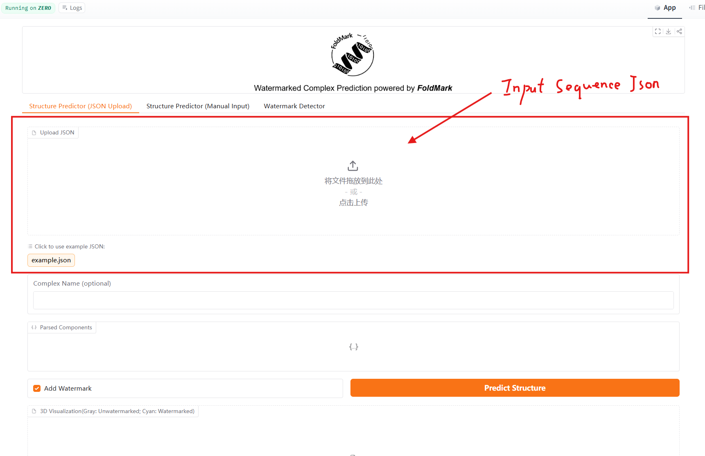
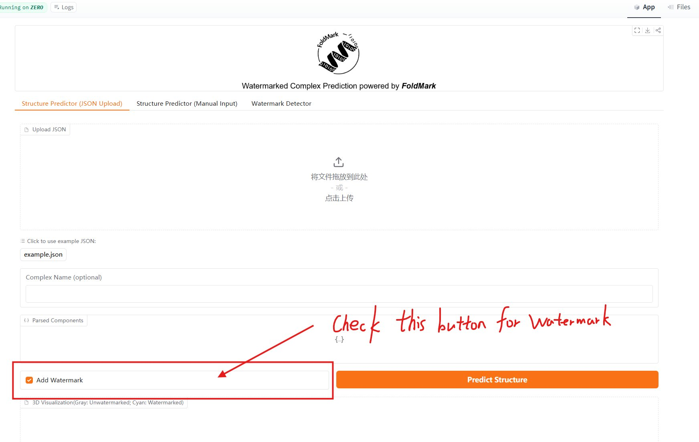
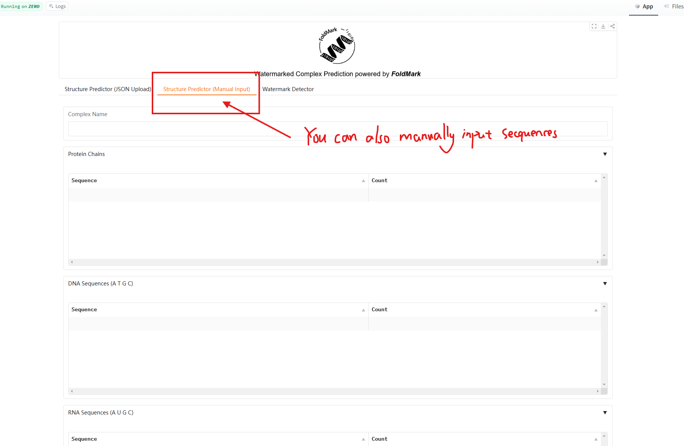
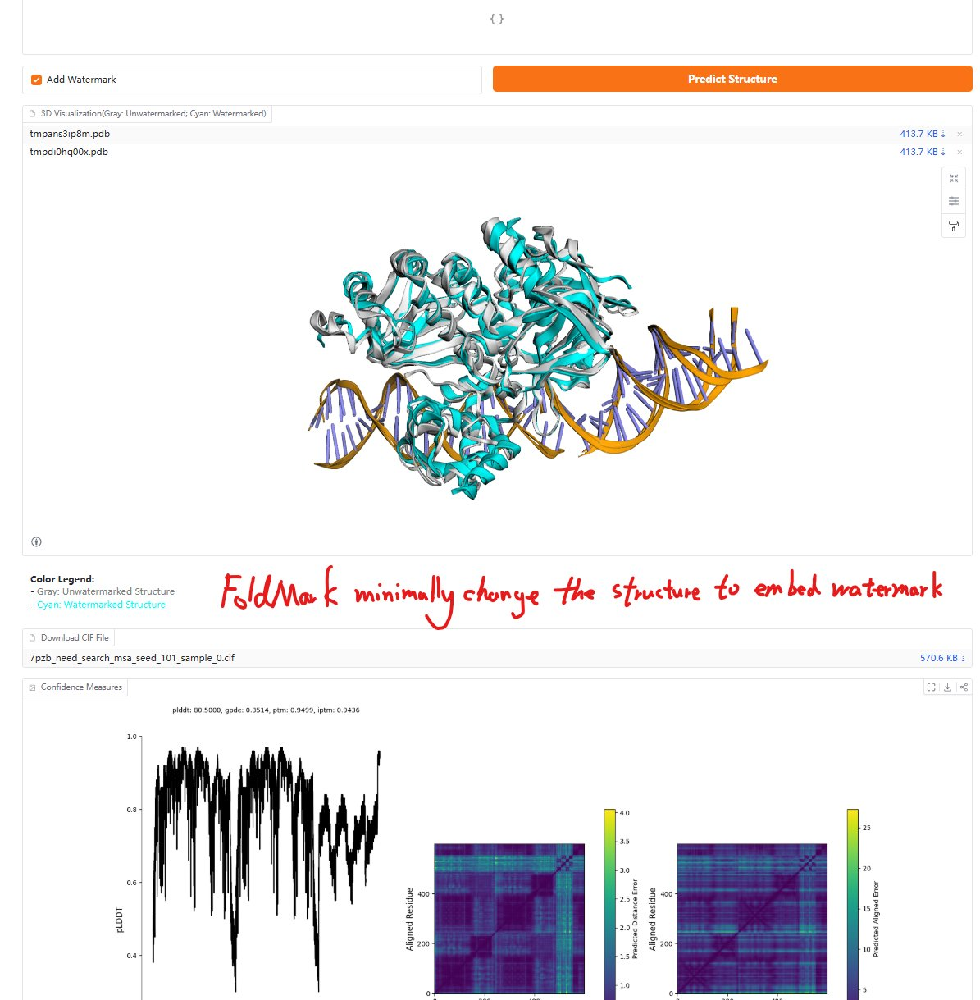
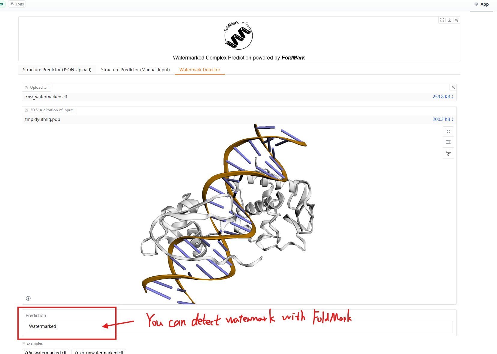

# FoldMark HuggingFace Demo Tutorial

**Live demo:** [https://huggingface.co/spaces/Zaixi/FoldMark](https://huggingface.co/spaces/Zaixi/FoldMark)

The demo provides three tools in a single interface:
1. **Structure Predictor (JSON Upload)** — predict watermarked structure from a JSON file
2. **Structure Predictor (Manual Input)** — type or paste sequences directly
3. **Watermark Detector** — verify whether a CIF structure carries a FoldMark watermark

---

## Part 1 — Watermarked Structure Prediction

### Option A: JSON Upload

**Step 1.** Open the **Structure Predictor (JSON Upload)** tab and upload a JSON
file describing your protein (or click `example.json` to try the built-in example).

<div align=center>

</div>

The JSON format follows the Protenix / AlphaFold 3 schema. A minimal
single-chain example:

```json
[{
  "sequences": [
    {
      "proteinChain": {
        "sequence": "MVSKGEELFTGVVPILVELDGDVNGHKFSVSGEGEGDATYGKLTLK...",
        "count": 1
      }
    }
  ],
  "name": "my_protein"
}]
```

You can also include DNA/RNA chains and ligands in the same JSON:

```json
[{
  "sequences": [
    {"proteinChain": {"sequence": "MAEVIRSS...", "count": 2}},
    {"dnaSequence": {"sequence": "CTAGGTAACATTACTCGCG", "count": 2}},
    {"ligand": {"ligand": "CCD_PCG", "count": 2}}
  ],
  "name": "my_complex"
}]
```

---

**Step 2.** Check the **Add Watermark** box (enabled by default), then click
**Predict Structure**.

<div align=center>

</div>

> Leaving **Add Watermark** unchecked runs plain Protenix prediction with no
> watermark embedded — useful as a reference to measure the structural impact.

---

### Option B: Manual Input

Switch to the **Structure Predictor (Manual Input)** tab to enter sequences
directly without preparing a JSON file.

<div align=center>

</div>

Fill in the **Protein Chains**, **DNA Sequences**, **RNA Sequences**, and/or
**Ligands** tables, set the **Complex Name**, then check **Add Watermark** and
click **Predict Structure**.

---

### Output: 3D Visualization and CIF Download

After prediction completes, the viewer shows:
- **Gray** — un-watermarked Protenix prediction (reference)
- **Cyan** — watermarked FoldMark prediction

The two structures are superimposed; FoldMark introduces only minimal backbone
perturbation (TM-score > 0.98 for typical proteins) while reliably embedding
the watermark signal.

<div align=center>

</div>

Click **Download CIF File** to save the watermarked structure. The CIF can be
used directly in downstream analyses (ProteinMPNN inverse folding, MolProbity,
etc.).

---

## Part 2 — Watermark Detection

Switch to the **Watermark Detector** tab and upload a `.cif` file.

FoldMark will decode the 32-bit watermark from the backbone and display:
- **Watermarked** — the file carries a detectable FoldMark signal
- **Not Watermarked** — no signal detected

<div align=center>

</div>

Two example CIF files are provided (`7r6r_watermarked.cif` and
`7pzb_unwatermarked.cif`) so you can test the detector without running a full
prediction first.

---

## Input format reference

| Field | Description |
|-------|-------------|
| `sequence` | Single-letter amino-acid / nucleotide string |
| `count` | Number of copies of this chain in the complex |
| `ligand` | CCD ligand identifier (e.g. `CCD_ATP`) |
| `name` | Identifier for the prediction job |

---

## Downstream pipeline (local)

After downloading a watermarked CIF from the demo, continue with the local
three-step pipeline to redesign sequences and validate the watermark:

```bash
# Convert demo CIF to PDB, then run ProteinMPNN + ESM2 scoring
python tutorials/egfp/step2_proteinmpnn_inverse_folding.py \
    --watermarked_pdb <downloaded_structure>.pdb \
    --mpnn_dir ./ProteinMPNN

python tutorials/egfp/step3_esm2_ranking.py
```

See [`tutorials/egfp/`](../egfp/) and [`tutorials/cas13/`](../cas13/) for the
complete reproduction pipelines for the wet-lab experiments.
